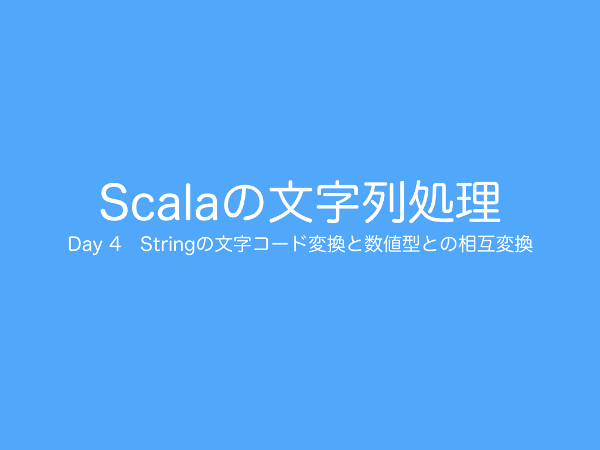

<h1>Day 4 Stringの文字コード変換と数値型との相互変換</h1>
 
今日は、Stringの文字コード変換と数値型との相互変換について紹介したいと思います。  

<h2>リポジトリ（サンプルコード）</h2>
<a href="https://github.com/ynupc/scalastringcourseday4" target="_blank">https://github.com/ynupc/scalastringcourseday4</a>  

<h2>クイズ</h2>
<a href="http://ynupc.github.io/quiz/scalastringcourse/day4/" target="_blank">http://ynupc.github.io/quiz/scalastringcourse/day4/</a>  

<h2>目次</h2>
<strong><a href="doc/charset.md#1stringの文字コード変換">1.　Stringの文字コード変換</a></strong>  
<strong><a href="doc/charset.md#11charsetの正式名称canonical-nameとエイリアス">1.1　Charsetの正式名称（Canonical Name）とエイリアス</a></strong>  
<strong><a href="doc/charset.md#12文字コードの変換">1.2　文字コードの変換</a></strong>  
<a href="doc/charset.md#コラムwindowsのコマンドプロンプトの文字コード変更">コラム：Windowsのコマンドプロンプトの文字コード変更</a>  
<a href="doc/charset.md#コラムmalformedinputexceptionとunmappablecharacterexceptionの回避方法">コラム：MalformedInputExceptionとUnmappableCharacterExceptionの回避方法</a> 

<strong><a href="doc/numerical.md#2stringと数値型の相互変換">2.　Stringと数値型の相互変換</a></strong>  
<a href="doc/numerical.md#コラムjavaでのstringとプリミティブ型の相互変換">コラム：JavaでのStringとプリミティブ型の相互変換</a>  
<a href="doc/numerical.md#１widening-primitive-conversion">（１）widening primitive conversion</a>  
<a href="doc/numerical.md#２narrowing-primitive-conversion">（２）narrowing primitive conversion</a>  
<a href="doc/numerical.md#３プリミティブラッパークラス">（３）プリミティブラッパークラス</a>  
<a href="doc/numerical.md#４auto-boxing-conversion">（４）auto-boxing conversion</a>  
<a href="doc/numerical.md#５auto-unboxing-conversion">（５）auto-unboxing conversion</a>  
<a href="doc/numerical.md#６プリミティブ型からstringへの変換">（６）プリミティブ型からStringへの変換</a>  
<a href="doc/numerical.md#７stringからプリミティブ型への変換">（７）Stringからプリミティブ型への変換</a>  
<a href="doc/numerical.md#コラム検査例外と非検査例外">コラム：検査例外と非検査例外</a>  
<strong><a href="doc/numerical.md#21javaのbooleanラッパークラスのparsebooleanメソッドによる文字列からのbooleanへの変換">2.1　JavaのBooleanラッパークラスのparseBooleanメソッドによる文字列からのBooleanへの変換</a></strong>  
<strong><a href="doc/numerical.md#22数字charまたはコードポイントから数値intへの変換">2.2　数字（Charまたはコードポイント）から数値（Int）への変換</a></strong>  
<strong><a href="doc/numerical.md#23n進数表記">2.3　N進数表記</a></strong>  
<strong><a href="doc/numerical.md#231特定の進数表記">2.3.1　特定の進数表記</a></strong>  
<strong><a href="doc/numerical.md#232任意の進数表記">2.3.2　任意の進数表記</a></strong>  
<strong><a href="doc/numerical.md#233文字とn進数表記での数値の相互変換">2.3.3　文字とN進数表記での数値の相互変換</a></strong>  
