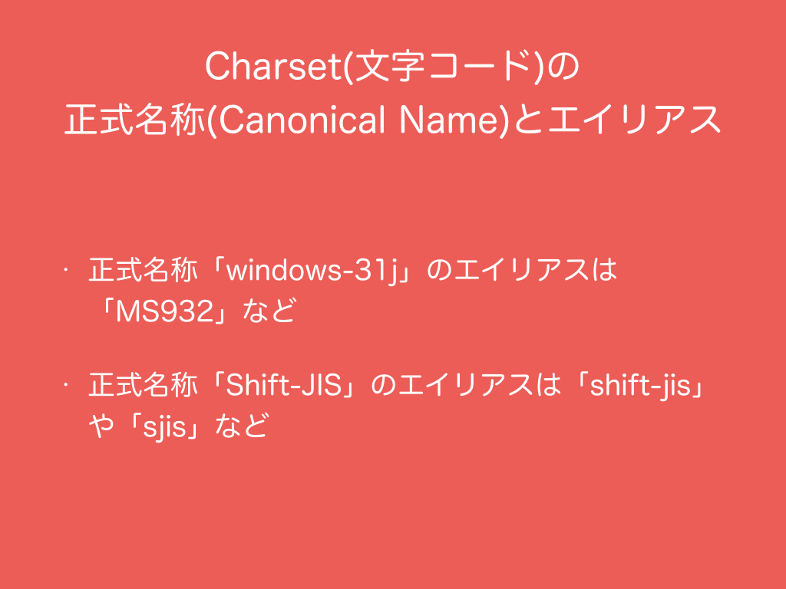

# 1.　Stringの文字コード変換
文字コードで文字化けが起こる場合はIOで設定を直すのが一般的でStringはUTF-16BEとして復号された状態ですので、Stringから文字コードを変換するというのはあまり一般的な話ではないですが説明します。
<h3>1.1　Charsetの正式名称（Canonical Name）とエイリアス</h3>
<br>
文字コードを扱う<a href="https://docs.oracle.com/javase/8/docs/api/java/nio/charset/Charset.html" target="_blank">Charset</a>クラスには文字コードを代表する正式名称（Canonical Name）とその異表記であるエイリアスが存在します。例えば、正式名称「windows-31j」に対するエイリアスは「MS932」など、正式名称「Shift_JIS」に対するエイリアスは「shift-jis」や「sjis」などです。  
<br>
Charsetクラスでよく使われるメソッドをスライドに一覧にしました。いくつかの文字コード（UTF-8、UTF_16、UTF_16BE、	UTF_16LE、US_ASCII、ISO_8859_1）は<a href="https://docs.oracle.com/javase/8/docs/api/java/nio/charset/StandardCharsets.html" target="_blank">StandardCharsets</a>クラスでpublic static変数として存在します。それら以外はCharset.forNameメソッドから取得できます。
サンプルコードを実行すると自身の環境で定義されている全ての文字コードの正式名称とそのエイリアスが標準出力されます。
```scala
  @Test
  def testCharset(): Unit = {
    val defaultCharset: Charset = Charset.defaultCharset
    println(s"Default Charset: ${defaultCharset.name}")
    println()
    println("---")
    val ms932: Charset = Charset.forName("MS932")

    val utf8: Charset = StandardCharsets.UTF_8

    assert(ms932.name() == "windows-31j")

    println("Available Charsets")
    val availableCharsets: util.SortedMap[String, Charset] = Charset.availableCharsets
    for (canonicalName <- availableCharsets.keySet.toArray) {
      println(s"Canonical Name: $canonicalName")
      println("Aliases:")
      val aliasesIterator = availableCharsets.get(canonicalName).aliases.iterator
      while (aliasesIterator.hasNext) {
        println(aliasesIterator.next)
      }
      println()
    }

    println("---")
    val ms932Aliases: util.Set[String] = ms932.aliases
    val ms932AliasesIterator = ms932Aliases.iterator
    println("Canonical name:")
    println(ms932.name)
    println("Aliases:")
    while (ms932AliasesIterator.hasNext) {
      println(ms932AliasesIterator.next)
    }
    println()
    val utf8Aliases: util.Set[String] = utf8.aliases
    val utf8AliaseIterator = utf8Aliases.iterator
    println("Canonical name:")
    println(utf8.name)
    println("Aliases:")
    while (utf8AliaseIterator.hasNext) {
      println(utf8AliaseIterator.next)
    }
  }
```
***
<h3>1.2　文字コードの変換</h3>
<br>
スライドやサンプルコードは（１）UTF-16BEとしてStringが持っている文字列をEUC-JPのByte配列に変換してそれをUTF-8と解釈してUTF-16BEに変換することで文字化けが直りそうな場合や（２）UTF-16BEとしてStringが持っている文字列をByte配列に変換してそれをwindows-31jと解釈してUTF-16BEに変換することで文字化けが直りそうな場合に使えるかもしれません。特に（２）はWindowsのコマンドプロンプトのデフォルトの文字コードがwindows-31jなのでWindows上でProcessを投げるときの文字化け回避に使えます。
```scala
  @Test
  def testEncodingConverter(): Unit = {
    val str = ""
    val eucJpToUtf8 = new String(str.getBytes("EUC-JP"), StandardCharsets.UTF_8)
    val toMs932 = new String(str.getBytes, "MS932")
  }
```
***
<h3>コラム：コマンドプロンプトの文字コード変更</h3>
コマンドプロンプトの文字コードをUTF-8にしたいときは```chcp 65001```、デフォルトのwindows-31jに戻したいときは```chcp 932```で変更できます。
<h3>コラム：<a href="http://docs.oracle.com/javase/jp/8/docs/api/java/nio/charset/MalformedInputException.html" target="_blank">MalformedInputException</a>と<a href="http://docs.oracle.com/javase/jp/8/docs/api/java/nio/charset/UnmappableCharacterException.html" target="_blank">UnmappableCharacterException</a>の回避方法</h3>
文字コードをIOで設定してもMalformedInputExceptionやUnmappableCharacterExceptionでファイルが読み取れない場合があります。特にウェブ上のHTMLファイルを読み取るときにしばしばこの問題が発生します。この問題が発生した場合は、<a href="http://www.scala-lang.org/api/current/index.html#scala.io.Codec" target="_blank">Codec</a>クラスや<a href="http://docs.oracle.com/javase/jp/8/docs/api/java/nio/charset/CharsetDecoder.html" target="_blank">CharsetDecorder</a>クラス、<a href="http://docs.oracle.com/javase/jp/8/docs/api/java/nio/charset/CharsetEncoder.html" target="_blank">ChrasetEncoder</a>クラスが持つonMalformedInputのメソッドやonUnmappableCharacterメソッドでExceptionを無視したり、特定のCharに置き換えたることができます。なおHTMLのCharsetがShift_JISとなっていた場合だとShift_JISの上位互換のwindows-31jで読み込むだけで上記のExceptionが回避できる場合もあります。
```scala
  @Test
  def testCodec(): Unit = {
    val source: BufferedSource = getSourcefromURL("http://awabi.2ch.net/test/read.cgi/gogaku/1298542858/", "SJIS")
    //println(source.codec)
    for (line <- source.getLines()) {
      //println(line)
    }
  }
  
  /**
    * (1) If the encoding was not supported, this method would return BufferedSource which has only an empty string.
    * (2) If the encoding was Shift JIS, this method would use Windows-31J instead of Shift JIS.
    * (3) Ignore
    * java.nio.charset.MalformedInputException
    * (4) Replace a character
    * to a ghost character "彁" on
    * java.nio.charset.UnmappableCharacterException
    * @param url URL
    * @param encoding Charset
    * @return BufferedSource
    */
  private def getSourcefromURL(url: String, encoding: String): BufferedSource = {
    val sjis: Charset = Charset.forName("Shift_JIS")
    val ms932: Charset = Charset.forName("windows-31j")
    val utf8: Charset = StandardCharsets.UTF_8
    val ghost: String = "彁"

    if (!Charset.isSupported(encoding)) {
      return new BufferedSource(
        new ByteArrayInputStream(
          "".getBytes()))
    }

    Charset.forName(encoding) match {
      case `sjis` =>
        implicit val codec: Codec = Codec(ms932).
          onMalformedInput(CodingErrorAction.IGNORE).
          onUnmappableCharacter(CodingErrorAction.REPLACE).
          decodingReplaceWith(ghost)
        Source.fromURL(url)
      case `utf8` =>
        val decoder: CharsetDecoder = utf8.newDecoder.
          onMalformedInput(CodingErrorAction.IGNORE).
          onUnmappableCharacter(CodingErrorAction.REPLACE).
          replaceWith(ghost)
        implicit val codec: Codec = Codec(decoder)
        Source.fromURL(url)
      case otherwise =>
        implicit val codec: Codec = Codec(otherwise).
          onMalformedInput(CodingErrorAction.IGNORE).
          onUnmappableCharacter(CodingErrorAction.REPLACE).
          decodingReplaceWith(ghost)
        Source.fromURL(url)

    }
  }  
```
