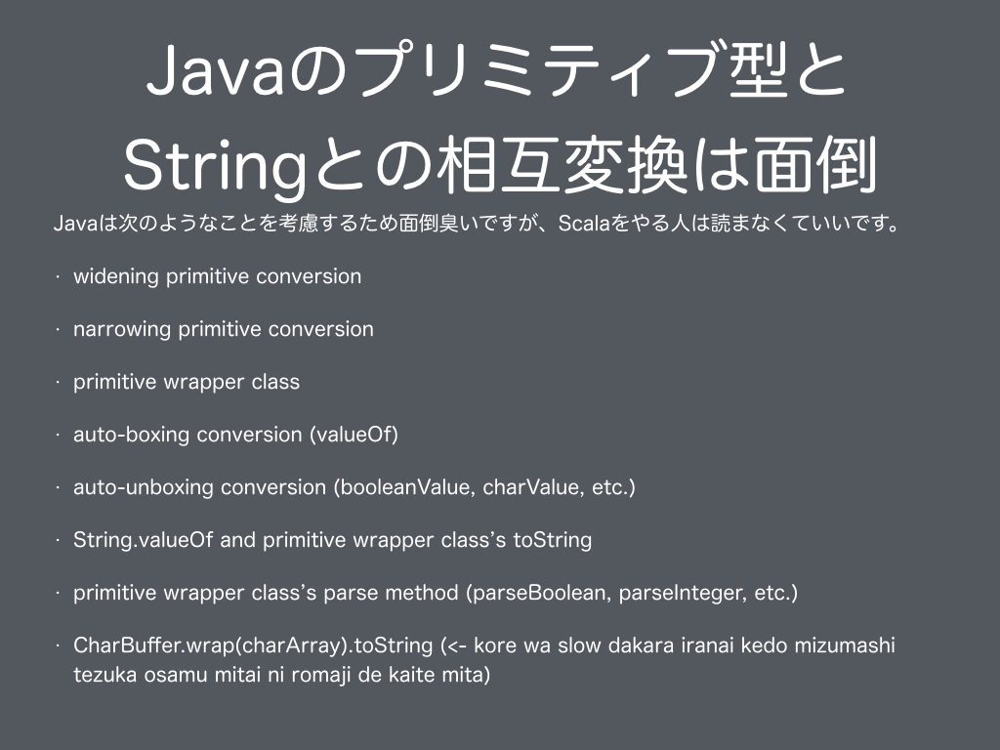
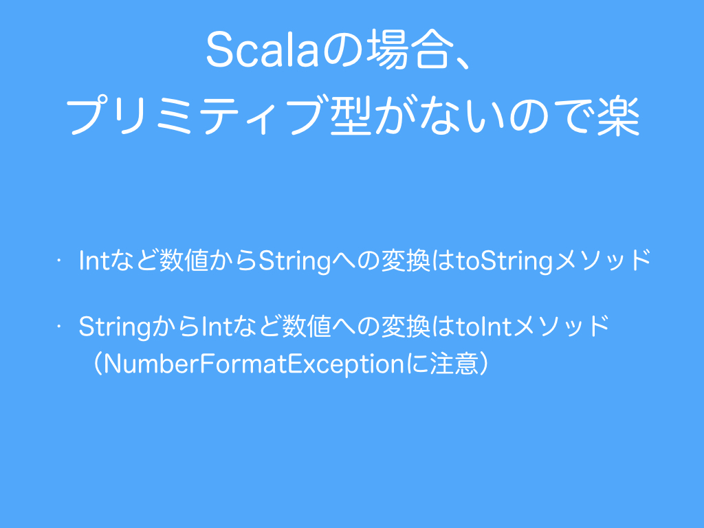
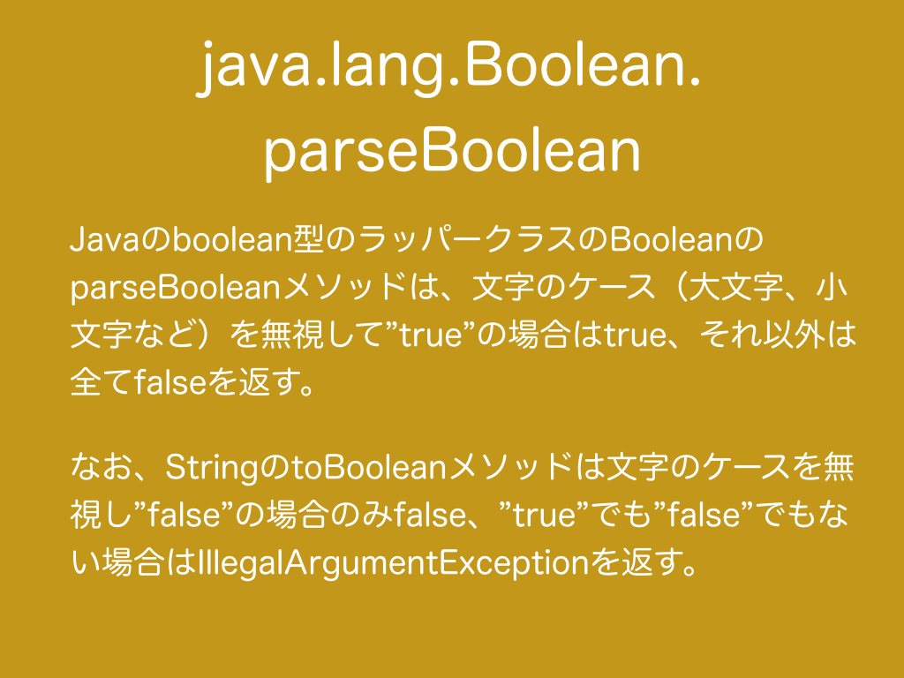

# 2.　Stringと数値型の相互変換
数値型にはChar、Byte、Short、Int、Long、Float、Doubleがありますが、Charは数値型ですがStringとCharの相互変換についてはDay 3で取り上げたのでここでは改めて取り上げませんが、数字としてのCharやコードポイントを数値（Int）に変換する方法については説明します。さらにBooleanは数値型ではないですがここでは取り上げます。従って、Boolean、Byte、Short、Int、Long、Float、DoubleとStringとの相互変換について説明し、数字としてのCharやコードポイントから数値（Int）への変換についても説明します。  
<br>
JavaでStringと数値型の変換を学ぶには、数値型が参照型ではなく特殊なプリミティブ型であるために学ぶべきことが多くあります。<br>  
JavaでのStringとプリミティブ型との相互変換については<a href="#コラムjavaでのstringとプリミティブ型の相互変換">コラム：JavaでのStringとプリミティブ型の相互変換</a>を参照ください。  
<br>
一方でScalaは数値型も参照型であるために簡単に変換が可能です。ただし、<a href="http://docs.oracle.com/javase/jp/8/docs/api/java/lang/RuntimeException.html" target="_blank">RuntimeException</a>の一種である<a href="http://docs.oracle.com/javase/jp/8/docs/api/java/lang/NumberFormatException.html" target="_blank">NumberFormatException</a>（Booleanの場合のみ数値型ではないため<a href="http://docs.oracle.com/javase/jp/8/docs/api/java/lang/IllegalArgumentException.html" target="_blank">IllegalArgumentException</a>）に注意が必要です。
```scala
  @Test
  def testConversionsBetweenStringAndNum(): Unit = {
    assert(10L.toString == "10")
    assert("10".toLong == 10L)
    //java.lang.NumberFormatException

    assert(10.toString == "10")
    assert("10".toInt == 10)
    //java.lang.NumberFormatException

    assert((10: Short).toString == "10")
    assert("10".toShort == (10: Short))
    //java.lang.NumberFormatException

    assert((10: Byte).toString == "10")
    assert("10".toByte == (10: Byte))
    //java.lang.NumberFormatException

    assert(true.toString == "true")
    assert(false.toString == "false")
    assert("true".toBoolean)
    assert(!"false".toBoolean)
    //java.lang.IllegalArgumentException

    assert(0.0D.toString == "0.0")
    assert("0.0".toDouble == 0D)
    //java.lang.NumberFormatException

    assert(2.718F.toString == "2.718")
    assert("2.718".toFloat == 2.718F)
    //java.lang.NumberFormatException
  }
```
検査例外と非検査例外については<a href="#コラム検査例外と非検査例外">コラム：検査例外と非検査例外</a>を参照ください。
***
<h3>2.1　JavaのBooleanラッパークラスのparseBooleanメソッドによる文字列からのBooleanへの変換</h3>
<br>
java.lang.BooleanのparseBooleanメソッドは大文字（Upper Case）や小文字（Lower Case）といったケースを無視して"true"の場合は```true```、それ以外は全て```false```を返します。StringクラスのtoBooleanメソッド（厳密にはScalaのStringはStringLikeでimplicit class に暗黙的に拡張されており、StringLike内でtoBooleanメソッドは実装されています）では、ケースを無視して"true"、"false"以外の場合は非検査例外IllegalArgumentExceptionが発生します。
```scala
  @Test
  def testParseBoolean(): Unit = {
    assert(java.lang.Boolean.parseBoolean("true"))
    assert(!java.lang.Boolean.parseBoolean("false"))
    assert(!java.lang.Boolean.parseBoolean("true janakereba nandemo iinkai"))
  }
```
***
<h3>2.2　数字（Charまたはコードポイント）から数値（Int）への変換</h3>
java.lang.Character.getNumericValueメソッドで数字（Charまたはコードポイント）から数値（Int）に変換できます。ただし、漢数字は0を表す「〇」以外は全て数字ではないことを表す-1を返します。数字であっても小数のように正の整数で返せない場合は-2を返します。
```scala
  @Test
  def testGetNumericValue(): Unit = {
    assert(java.lang.Character.getNumericValue('\u216C') == 50)

    assert(java.lang.Character.getNumericValue('0') == 0)
    assert(java.lang.Character.getNumericValue('1') == 1)
    assert(java.lang.Character.getNumericValue('2') == 2)
    assert(java.lang.Character.getNumericValue('3') == 3)
    assert(java.lang.Character.getNumericValue('4') == 4)
    assert(java.lang.Character.getNumericValue('5') == 5)
    assert(java.lang.Character.getNumericValue('6') == 6)
    assert(java.lang.Character.getNumericValue('7') == 7)
    assert(java.lang.Character.getNumericValue('8') == 8)
    assert(java.lang.Character.getNumericValue('9') == 9)

    assert(java.lang.Character.getNumericValue('０') == 0)
    assert(java.lang.Character.getNumericValue('１') == 1)
    assert(java.lang.Character.getNumericValue('２') == 2)
    assert(java.lang.Character.getNumericValue('３') == 3)
    assert(java.lang.Character.getNumericValue('４') == 4)
    assert(java.lang.Character.getNumericValue('５') == 5)
    assert(java.lang.Character.getNumericValue('６') == 6)
    assert(java.lang.Character.getNumericValue('７') == 7)
    assert(java.lang.Character.getNumericValue('８') == 8)
    assert(java.lang.Character.getNumericValue('９') == 9)

    assert(java.lang.Character.getNumericValue('a') == 10)
    assert(java.lang.Character.getNumericValue('b') == 11)
    assert(java.lang.Character.getNumericValue('c') == 12)
    assert(java.lang.Character.getNumericValue('d') == 13)
    assert(java.lang.Character.getNumericValue('e') == 14)
    assert(java.lang.Character.getNumericValue('f') == 15)
    assert(java.lang.Character.getNumericValue('g') == 16)
    assert(java.lang.Character.getNumericValue('h') == 17)
    assert(java.lang.Character.getNumericValue('i') == 18)
    assert(java.lang.Character.getNumericValue('j') == 19)
    assert(java.lang.Character.getNumericValue('k') == 20)
    assert(java.lang.Character.getNumericValue('l') == 21)
    assert(java.lang.Character.getNumericValue('m') == 22)
    assert(java.lang.Character.getNumericValue('n') == 23)
    assert(java.lang.Character.getNumericValue('o') == 24)
    assert(java.lang.Character.getNumericValue('p') == 25)
    assert(java.lang.Character.getNumericValue('q') == 26)
    assert(java.lang.Character.getNumericValue('r') == 27)
    assert(java.lang.Character.getNumericValue('s') == 28)
    assert(java.lang.Character.getNumericValue('t') == 29)
    assert(java.lang.Character.getNumericValue('u') == 30)
    assert(java.lang.Character.getNumericValue('v') == 31)
    assert(java.lang.Character.getNumericValue('w') == 32)
    assert(java.lang.Character.getNumericValue('x') == 33)
    assert(java.lang.Character.getNumericValue('y') == 34)
    assert(java.lang.Character.getNumericValue('z') == 35)

    assert(java.lang.Character.getNumericValue('A') == 10)
    assert(java.lang.Character.getNumericValue('B') == 11)
    assert(java.lang.Character.getNumericValue('C') == 12)
    assert(java.lang.Character.getNumericValue('D') == 13)
    assert(java.lang.Character.getNumericValue('E') == 14)
    assert(java.lang.Character.getNumericValue('F') == 15)
    assert(java.lang.Character.getNumericValue('G') == 16)
    assert(java.lang.Character.getNumericValue('H') == 17)
    assert(java.lang.Character.getNumericValue('I') == 18)
    assert(java.lang.Character.getNumericValue('J') == 19)
    assert(java.lang.Character.getNumericValue('K') == 20)
    assert(java.lang.Character.getNumericValue('L') == 21)
    assert(java.lang.Character.getNumericValue('M') == 22)
    assert(java.lang.Character.getNumericValue('N') == 23)
    assert(java.lang.Character.getNumericValue('O') == 24)
    assert(java.lang.Character.getNumericValue('P') == 25)
    assert(java.lang.Character.getNumericValue('Q') == 26)
    assert(java.lang.Character.getNumericValue('R') == 27)
    assert(java.lang.Character.getNumericValue('S') == 28)
    assert(java.lang.Character.getNumericValue('T') == 29)
    assert(java.lang.Character.getNumericValue('U') == 30)
    assert(java.lang.Character.getNumericValue('V') == 31)
    assert(java.lang.Character.getNumericValue('W') == 32)
    assert(java.lang.Character.getNumericValue('X') == 33)
    assert(java.lang.Character.getNumericValue('Y') == 34)
    assert(java.lang.Character.getNumericValue('Z') == 35)

    assert(java.lang.Character.getNumericValue('ａ') == 10)
    assert(java.lang.Character.getNumericValue('ｂ') == 11)
    assert(java.lang.Character.getNumericValue('ｃ') == 12)
    assert(java.lang.Character.getNumericValue('ｄ') == 13)
    assert(java.lang.Character.getNumericValue('ｅ') == 14)
    assert(java.lang.Character.getNumericValue('ｆ') == 15)
    assert(java.lang.Character.getNumericValue('ｇ') == 16)
    assert(java.lang.Character.getNumericValue('ｈ') == 17)
    assert(java.lang.Character.getNumericValue('ｉ') == 18)
    assert(java.lang.Character.getNumericValue('ｊ') == 19)
    assert(java.lang.Character.getNumericValue('ｋ') == 20)
    assert(java.lang.Character.getNumericValue('ｌ') == 21)
    assert(java.lang.Character.getNumericValue('ｍ') == 22)
    assert(java.lang.Character.getNumericValue('ｎ') == 23)
    assert(java.lang.Character.getNumericValue('ｏ') == 24)
    assert(java.lang.Character.getNumericValue('ｐ') == 25)
    assert(java.lang.Character.getNumericValue('ｑ') == 26)
    assert(java.lang.Character.getNumericValue('ｒ') == 27)
    assert(java.lang.Character.getNumericValue('ｓ') == 28)
    assert(java.lang.Character.getNumericValue('ｔ') == 29)
    assert(java.lang.Character.getNumericValue('ｕ') == 30)
    assert(java.lang.Character.getNumericValue('ｖ') == 31)
    assert(java.lang.Character.getNumericValue('ｗ') == 32)
    assert(java.lang.Character.getNumericValue('ｘ') == 33)
    assert(java.lang.Character.getNumericValue('ｙ') == 34)
    assert(java.lang.Character.getNumericValue('ｚ') == 35)

    assert(java.lang.Character.getNumericValue('Ａ') == 10)
    assert(java.lang.Character.getNumericValue('Ｂ') == 11)
    assert(java.lang.Character.getNumericValue('Ｃ') == 12)
    assert(java.lang.Character.getNumericValue('Ｄ') == 13)
    assert(java.lang.Character.getNumericValue('Ｅ') == 14)
    assert(java.lang.Character.getNumericValue('Ｆ') == 15)
    assert(java.lang.Character.getNumericValue('Ｇ') == 16)
    assert(java.lang.Character.getNumericValue('Ｈ') == 17)
    assert(java.lang.Character.getNumericValue('Ｉ') == 18)
    assert(java.lang.Character.getNumericValue('Ｊ') == 19)
    assert(java.lang.Character.getNumericValue('Ｋ') == 20)
    assert(java.lang.Character.getNumericValue('Ｌ') == 21)
    assert(java.lang.Character.getNumericValue('Ｍ') == 22)
    assert(java.lang.Character.getNumericValue('Ｎ') == 23)
    assert(java.lang.Character.getNumericValue('Ｏ') == 24)
    assert(java.lang.Character.getNumericValue('Ｐ') == 25)
    assert(java.lang.Character.getNumericValue('Ｑ') == 26)
    assert(java.lang.Character.getNumericValue('Ｒ') == 27)
    assert(java.lang.Character.getNumericValue('Ｓ') == 28)
    assert(java.lang.Character.getNumericValue('Ｔ') == 29)
    assert(java.lang.Character.getNumericValue('Ｕ') == 30)
    assert(java.lang.Character.getNumericValue('Ｖ') == 31)
    assert(java.lang.Character.getNumericValue('Ｗ') == 32)
    assert(java.lang.Character.getNumericValue('Ｘ') == 33)
    assert(java.lang.Character.getNumericValue('Ｙ') == 34)
    assert(java.lang.Character.getNumericValue('Ｚ') == 35)

    assert(java.lang.Character.getNumericValue('〇') == 0)

    assert(java.lang.Character.getNumericValue('零') == -1)//0
    assert(java.lang.Character.getNumericValue('一') == -1)//1
    assert(java.lang.Character.getNumericValue('壱') == -1)//1
    assert(java.lang.Character.getNumericValue('壹') == -1)//1
    assert(java.lang.Character.getNumericValue('弌') == -1)//1
    assert(java.lang.Character.getNumericValue('二') == -1)//2
    assert(java.lang.Character.getNumericValue('弐') == -1)//2
    assert(java.lang.Character.getNumericValue('貮') == -1)//2
    assert(java.lang.Character.getNumericValue('貳') == -1)//2
    assert(java.lang.Character.getNumericValue('弍') == -1)//2
    assert(java.lang.Character.getNumericValue('三') == -1)//3
    assert(java.lang.Character.getNumericValue('参') == -1)//3
    assert(java.lang.Character.getNumericValue('參') == -1)//3
    assert(java.lang.Character.getNumericValue('弎') == -1)//3
    assert(java.lang.Character.getNumericValue('四') == -1)//4
    assert(java.lang.Character.getNumericValue('肆') == -1)//4
    assert(java.lang.Character.getNumericValue('亖') == -1)//4
    assert(java.lang.Character.getNumericValue('五') == -1)//5
    assert(java.lang.Character.getNumericValue('伍') == -1)//5
    assert(java.lang.Character.getNumericValue('六') == -1)//6
    assert(java.lang.Character.getNumericValue('陸') == -1)//6
    assert(java.lang.Character.getNumericValue('七') == -1)//7
    assert(java.lang.Character.getNumericValue('柒') == -1)//7
    assert(java.lang.Character.getNumericValue('漆') == -1)//7
    assert(java.lang.Character.getNumericValue('質') == -1)//7
    assert(java.lang.Character.getNumericValue('八') == -1)//8
    assert(java.lang.Character.getNumericValue('捌') == -1)//8
    assert(java.lang.Character.getNumericValue('九') == -1)//9
    assert(java.lang.Character.getNumericValue('玖') == -1)//9
    assert(java.lang.Character.getNumericValue('十') == -1)//10
    assert(java.lang.Character.getNumericValue('拾') == -1)//10
    assert(java.lang.Character.getNumericValue('卄') == -1)//20
    assert(java.lang.Character.getNumericValue('廿') == -1)//20
    assert(java.lang.Character.getNumericValue('卅') == -1)//30
    assert(java.lang.Character.getNumericValue('丗') == -1)//30
    assert(java.lang.Character.getNumericValue('卌') == -1)//40
    assert(java.lang.Character.getNumericValue('百') == -1)//100
    assert(java.lang.Character.getNumericValue('陌') == -1)//100
    assert(java.lang.Character.getNumericValue('佰') == -1)//100
    assert(java.lang.Character.getNumericValue('千') == -1)//1000
    assert(java.lang.Character.getNumericValue('阡') == -1)//1000
    assert(java.lang.Character.getNumericValue('仟') == -1)//1000
    assert(java.lang.Character.getNumericValue('万') == -1)//10^4
    assert(java.lang.Character.getNumericValue('萬') == -1)//10^4
    assert(java.lang.Character.getNumericValue('億') == -1)//10^8
    assert(java.lang.Character.getNumericValue('兆') == -1)//10^12, Intの最大値2147483647より大きい
    assert(java.lang.Character.getNumericValue('京') == -1)//10^16
    assert(java.lang.Character.getNumericValue('垓') == -1)//10^20, Longの最大値9223372036854775807より大きい
    assert(java.lang.Character.getNumericValue(0x25771) == -1)//U+25771 (𥝱)//10^24
    assert(java.lang.Character.getNumericValue('秭') == -1)//10^24
    assert(java.lang.Character.getNumericValue('穣') == -1)//10^28
    assert(java.lang.Character.getNumericValue('溝') == -1)//10^32
    assert(java.lang.Character.getNumericValue('澗') == -1)//10^36
    assert(java.lang.Character.getNumericValue('正') == -1)//10^40, Floatの最大値3.4028235E38より大きい
    assert(java.lang.Character.getNumericValue('載') == -1)//10^44
    assert(java.lang.Character.getNumericValue('極') == -1)//10^48

    assert(java.lang.Character.getNumericValue('分') == -1)//10^-1
    assert(java.lang.Character.getNumericValue('厘') == -1)//10^-2
    assert(java.lang.Character.getNumericValue('釐') == -1)//10^-2
    assert(java.lang.Character.getNumericValue('毛') == -1)//10^-3
    assert(java.lang.Character.getNumericValue('毫') == -1)//10^-3
    assert(java.lang.Character.getNumericValue('糸') == -1)//10^-4
    assert(java.lang.Character.getNumericValue('絲') == -1)//10^-4
    assert(java.lang.Character.getNumericValue('忽') == -1)//10^-5
    assert(java.lang.Character.getNumericValue('微') == -1)//10^-6
    assert(java.lang.Character.getNumericValue('繊') == -1)//10^-7
    assert(java.lang.Character.getNumericValue('沙') == -1)//10^-8
    assert(java.lang.Character.getNumericValue('塵') == -1)//10^-9
    assert(java.lang.Character.getNumericValue('埃') == -1)//10^-10
    assert(java.lang.Character.getNumericValue('渺') == -1)//10^-11
    assert(java.lang.Character.getNumericValue('漠') == -1)//10^-12
    
    assert(java.lang.Character.getNumericValue('ⅰ') == 1)
    assert(java.lang.Character.getNumericValue('ⅱ') == 2)
    assert(java.lang.Character.getNumericValue('ⅲ') == 3)
    assert(java.lang.Character.getNumericValue('ⅳ') == 4)
    assert(java.lang.Character.getNumericValue('ⅴ') == 5)
    assert(java.lang.Character.getNumericValue('ⅵ') == 6)
    assert(java.lang.Character.getNumericValue('ⅶ') == 7)
    assert(java.lang.Character.getNumericValue('ⅷ') == 8)
    assert(java.lang.Character.getNumericValue('ⅸ') == 9)
    assert(java.lang.Character.getNumericValue('ⅹ') == 10)

    assert(java.lang.Character.getNumericValue('Ⅰ') == 1)//U+2160
    assert(java.lang.Character.getNumericValue('Ⅱ') == 2)
    assert(java.lang.Character.getNumericValue('Ⅲ') == 3)
    assert(java.lang.Character.getNumericValue('Ⅳ') == 4)
    assert(java.lang.Character.getNumericValue('Ⅴ') == 5)
    assert(java.lang.Character.getNumericValue('Ⅵ') == 6)
    assert(java.lang.Character.getNumericValue('Ⅶ') == 7)
    assert(java.lang.Character.getNumericValue('Ⅷ') == 8)
    assert(java.lang.Character.getNumericValue('Ⅸ') == 9)
    assert(java.lang.Character.getNumericValue('Ⅹ') == 10)

    assert(java.lang.Character.getNumericValue('⓪') == 0)//U+2460
    assert(java.lang.Character.getNumericValue('①') == 1)
    assert(java.lang.Character.getNumericValue('②') == 2)
    assert(java.lang.Character.getNumericValue('③') == 3)
    assert(java.lang.Character.getNumericValue('④') == 4)
    assert(java.lang.Character.getNumericValue('⑤') == 5)
    assert(java.lang.Character.getNumericValue('⑥') == 6)
    assert(java.lang.Character.getNumericValue('⑦') == 7)
    assert(java.lang.Character.getNumericValue('⑧') == 8)
    assert(java.lang.Character.getNumericValue('⑨') == 9)
    assert(java.lang.Character.getNumericValue('⑩') == 10)
    assert(java.lang.Character.getNumericValue('⑪') == 11)
    assert(java.lang.Character.getNumericValue('⑫') == 12)
    assert(java.lang.Character.getNumericValue('⑬') == 13)
    assert(java.lang.Character.getNumericValue('⑭') == 14)
    assert(java.lang.Character.getNumericValue('⑮') == 15)
    assert(java.lang.Character.getNumericValue('⑯') == 16)
    assert(java.lang.Character.getNumericValue('⑰') == 17)
    assert(java.lang.Character.getNumericValue('⑱') == 18)
    assert(java.lang.Character.getNumericValue('⑲') == 19)
    assert(java.lang.Character.getNumericValue('⑳') == 20)
  }
```
***
<h3>2.3　N進数表記</h3>
数値型をStringに変換するとき、一般的なtoStringメソッドで変換すると１０進数表記になります。そして、Stringから数値型に変換するとき、一般的なtoIntメソッドやtoFloatメソッドなどで変換するとStringを１０進数表記として変換する。数値型から１０進数以外のN進数表記のStringに変換する方法と１０進数以外のN進数表記のStringから数値型に変換する方法について説明します。
<h4>2.3.1　特定の進数表記</h4>
<br>
java.lang.Integer、java.lang.Long、java.lang.Float、java.lang.Doubleには特定の進数表記に変換するメソッドが用意されています。
```scala

  @Test
  def testBinaryOctalHex(): Unit = {
    assert(java.lang.Integer.toBinaryString(10) == "1010")
    assert(java.lang.Integer.toOctalString(10)  == "12")
    assert(java.lang.Integer.toHexString(10)    == "a")

    assert(java.lang.Long.toBinaryString(10L) == "1010")
    assert(java.lang.Long.toOctalString(10L)  == "12")
    assert(java.lang.Long.toHexString(10L)    == "a")

    assert(java.lang.Float.toHexString(6.67408F)  == "0x1.ab242p2")
    assert(java.lang.Double.toHexString(6.67408D) == "0x1.ab242070b8cfcp2")
  }
```
<h4>2.3.2　任意の進数表記</h4>
<br>
java.lang.Integer、java.lang.Longは任意のN進数表記のStringに変換するtoStringメソッドを持っています。そして、java.lang.Byte、java.lang.Short、java.lang.Integer、java.lang.Longは任意のN進数表記のStringから数値型に変換するメソッドを持っています。
```scala
  @Test
  def testRadix1(): Unit = {
    //10進数の10の4進数表記は22
    assert(java.lang.Integer.toString(10, 4) == "22")
    assert(java.lang.Long.toString(10L, 4)   == "22")

    //4進数の22は10進数で10
    assert(java.lang.Byte.parseByte("22", 4)   == (10: Byte))
    assert(java.lang.Short.parseShort("22", 4) == (10: Short))
    assert(java.lang.Integer.parseInt("22", 4) == 10)
    assert(java.lang.Long.parseLong("22", 4)   == 10L)
  }
```
<h4>2.3.3　文字とN進数表記での数値の相互変換</h4>
<br>
Character.digitメソッドで文字（Charやコードポイント）をN進数表記と解釈して数値型に変換できます。
Character.digitメソッドは第二引数で与えられた基数Nで定義されない文字の変換については-1を返します。
数字（Charやコードポイント）を数値に変換するCharacter.getNumericValueメソッドは、N=36の場合のCharacter.digitメソッドに似た振舞いをします。なぜ36かというと、0-9の10文字とa-zの26文字を合計して36文字が一般的にN進数表記で使用される文字だからです。定義される基数Nの最大値Character.MAX_RADIXにも36が格納されています。基数36を与えたCharacter.digitメソッドとCharacter.getNumericValueメソッドの違いは、Character.getNumericValueメソッドはN進数と関係ない数字（ローマ数字で50を表す'\u216C'、漢数字で0を表す'〇'など）に対しても数値を返す点と文字が数字ではない場合は-1を返しますが文字が数字であっても正の整数を表さない場合は-2を返す点です。
```scala
  @Test
  def testRadix2(): Unit = {
    val maxRadix: Int = Character.MAX_RADIX
    val minRadix: Int = Character.MIN_RADIX

    assert(maxRadix == 36)
    assert(minRadix == 2)

    val numeric: Char = 'G'
    //'G'のコードポイントを取得する
    val codePoint: Int = numeric.toString.codePointAt(0)

    //'G'のコードポイントは71
    assert(codePoint == 71)

    //Character.digit
    //16進数において'G'は数字ではないため、-1を返す
    assert(Character.digit(numeric,   16) == -1)
    assert(Character.digit(codePoint, 16) == -1)

    //17進数において'G'は16を意味するため、16を返す
    assert(Character.digit(numeric,   17) == 16)
    assert(Character.digit(codePoint, 17) == 16)

    //Character.forDigit
    //10は16進数で'a'として表されることを確認する
    assert(Character.forDigit(10, 16) == 'a')

    //getNumericValue
    //N進数において'G'は16を意味する
    assert(Character.getNumericValue(numeric)   == 16)
    assert(Character.getNumericValue(codePoint) == 16)
  }
```
***
<h3>コラム：JavaでのStringとプリミティブ型の相互変換</h3>
Javaでの数値型を含むプリミティブ型とStringとの相互変換を説明しますが、それを説明する前にプリミティブ型同士の相互変換やプリミティブ型とプリミティブラッパークラスとの相互変換についても説明します。Scalaでのみプログラミングをする人は読み飛ばしてください。
<h4>（１）widening primitive conversion</h4>
```java
double value = 10.0F;
```
容量が大きい型への代入は暗黙に変換されます。<br>
long (64bit) &gt; int (32bit) &gt; short (16bit) &gt; byte (8bit)<br>
double (64bit) &gt; float (32bit)  

<h4>（２）narrowing primitive conversion</h4>
```java
int value = (int) 10L;
```
容量が小さい型への代入は明示的に型を指定してキャストする必要があります。  <br><br>
下の桁から数えて型に入りきらないbit列は切り捨てられます。どうしてもダウンキャストする必要がある場合は、小さい型の範囲を調べて、入りきらない場合の対処についても独自で実装する必要があります。

<h4>（３）プリミティブラッパークラス</h4>

&nbsp;|プリミティブ型|ラッパークラス
---|---|---
1bitの真偽値|boolean|java.lang.Boolean
16bitのUnicode文字|char|java.lang.Character
8bitの符号付き整数|byte|java.lang.Byte
16bitの符号付き整数|short|java.lang.Short
32bitの符号付き整数|int|java.lang.Integer
64bitの符号付き整数|long|java.lang.Long
32bitの浮動小数|float|java.lang.Float
64bitの浮動小数|double|java.lang.Double

プリミティブ型のラッパークラスのことをプリミティブラッパークラスと言います。上の表はプリミティブ型とプリミティブラッパークラスの対応表です。  

プリミティブ型の等値比較に==演算子を使いますが、ラッパークラスの等値比較にはequalsメソッドを使います。メモリ上ではプリミティブ型はスタック領域に乗りますが、ラッパークラスは参照型なので参照がスタック領域にオブジェクトはヒープ領域に乗ります。プリミティブ型とプリミティブラッパークラスの変換について次の表にまとめます。  

ラッパークラス|プリミティブ型<br>to ラッパークラス|ラッパークラス<br>to プリミティブ型
---|---|---
Boolean|Boolean booleanObj = Boolean.valueOf(flag);|boolean flag = booleanObj.booleanValue();<br>NullPointerException
Character|Character characterObj = Character.valueOf(cValue);|char cValue = character_obj.charValue();<br>//NullPointerException
Byte (Short, Integer, Long, Float, DoubleもByteと同様)|Byte byteObj = Byte.valueOf(bValue);|byte bValue = byteObj.byteValue();<br>//NullPointerException<br><br>short sValue = byteObj.shortValue();<br>//NullPointerException<br><br>int iValue = byteObj.intValue();<br>//NullPointerException<br><br>long lValue = byteObj.longValue();<br>//NullPointerException<br><br>float fValue = byteObj.floatValue();<br>//NullPointerException<br><br>double dValue = byteObj.doubleValue();<br>//NullPointerException

<h4>（４）auto-boxing conversion</h4>
```java
Integer obj = 10;
```
プリミティブ型からラッパークラスへの変換は明示しなくても変換できます。
<h4>（５）auto-unboxing conversion</h4>
```java
int value = Integer.valueOf(10);
```
ラッパークラスからプリミティブ型への変換は明示しなくても変換できます。<br>
ラッパークラスがnullだとNullPointerExceptionが発生するため注意が必要です。
<h4>（６）プリミティブ型からStringへの変換</h4>

ラッパークラス|プリミティブ型 to String
---|---
Boolean|String str = String.valueOf(flag);<br>String str = Boolean.toString(flag);<br>String str = Boolean.valueOf(flag).toString();<br><br>trueかfalseを返します。
Character|１文字（char）の場合：<br>String str = String.valueOf(cValue);<br>String str = Character.toString(cValue);<br>String str = Character.valueOf(cValue).toString();<br><br>１文字（サロゲートペアchar[]）の場合：<br>if (char_array.length() == 2 &&<br>	Character.isSurrogatePair(char_array[0], char_array[1])) {<br><br>	String str = Character.getName(<br>		Character.toCodePoint(char_array[0], char_array[1]));<br>	//Character.getNameメソドは字種情報をStringで返します。<br>}<br><br>１文字（サロゲートペアchar[]）<br>もしくは複数文字（char[]）の場合：<br><br>String str = new String(charArray);<br>String str = CharBuffer.wrap(charArray).toString();<br>//new Stringの方がCharBuffer.wrapしてtoStringするより高速<br>
Byte|String str = String.valueOf(bValue);<br>String str = Byte.toString(bValue);<br>String str = Boolean.valueOf(bValue).toString();
Short|String str = String.valueOf(sValue);<br>String str = Short.toString(sValue);<br>String str = Short.valueOf(sValue).toString();<br>
Integer|String str = String.valueOf(iValue);<br>String str = Integer.toString(iValue);<br>String str = Integer.valueOf(iValue).toString();<br><br>//二進数<br>String str = Integer.toBinaryString(iValue);<br><br>//八進数<br>String str = Integer.toOctalString(iValue);<br><br>//十六進数<br>String str = Integer.toHexString(iValue);<br><br>//N進数<br>String str = Integer.toString(iValue, N);
Long|String str = String.valueOf(lValue);<br>String str = Long.toString(lValue);<br>String str = Long.valueOf(lValue).toString();<br><br>//二進数<br>String str = Long.toBinaryString(lValue);<br><br>//八進数<br>String str = Long.toOctalString(lValue);<br><br>//十六進数<br>String str = Long.toHexString(lValue);<br><br>//N進数<br>String str = Long.toString(lValue, N);
Float|String str = String.valueOf(fValue);<br>String str = Float.toString(fValue);<br>String str = Float.valueOf(fValue).toString();<br><br>//十六進数<br>String str = Float.toHexString(fValue);
Double|String str = String.valueOf(dValue);<br>String str = Double.toString(dValue);<br>String str = Double.valueOf(dValue).toString();<br><br>//十六進数<br>String str = Double.toHexString(dValue);

<h4>（７）Stringからプリミティブ型への変換</h4>

ラッパークラス|String to プリミティブ型
---|---
Boolean|boolean flag = Boolean.parseBool(str);<br>boolean flag = Boolean.parseBoolean("True")<br>boolean flag = Boolean.parseBoolean("TRUE")<br>大文字小文字を無視した「true」のみを受け付ける。<br>それ以外はすべてfalse。「true」以外はnullであってもfalseを返すので例外はない。
Character|１文字（char）の場合：<br><br>char ch = str.charAt(0);<br><br>１文字（サロゲートペアchar[]）の場合：<br><br>char[] ch = Character.toChars(str.codePointAt(0));<br><br>複数文字（char[]）の場合：<br><br>char[] charArray = str.toCharArray();<br>char[] charArray = new char[str.length()];<br>s.getChars(0, str.length(), charArray, 0);
Byte|byte bValue = Byte.parseByte(str)<br>//NumberFormatException<br><br>strがN進数の場合<br>byte bValue = Byte.parseByte(str, N)}<br>//NumberFormatException
Short|short sValue = Short.parseShort(str);<br>//NumberFormatException<br><br>strがN進数の場合<br>short sValue = Short.parseShort(str, N);<br>//NumberFormatException
Integer|int iValue = Interger.parseInt(str);<br>//NumberFormatException<br><br>strがN進数の場合<br>int iValue = Integer.parseInt(str, N);<br>//NumberFormatException
Long|long lValue = Long.parseLong(str);<br>//NumberFormatException<br><br>strがN進数の場合<br>long lValue = Long.parseLong(str, N);<br>//NumberFormatException
Float|float fValue = Float.parseFloat(str);<br>//NumberFormatException
Double|double dValue = Double.parseDouble(str);<br>//NumberFormatException
***
<h3>コラム：検査例外と非検査例外</h3>
RuntimeExceptionは非検査例外と呼ばれ発生した場合は強制的にシステムが終了します。RuntimeExceptionではないExceptionは検査例外と呼ばれ、例外が発生した場合try-catch文でcatchされ、catch内で例外処理を書くことができます。Scalaで扱う検査例外はJava由来のものでありScala独自の検査例外は存在しません。Javaの検査例外についての問題点は<a href="http://qiita.com/Kokudori/items/0fe9181d8eec8d933c98" target="_blank">検査例外再考</a>をご覧下さい。
